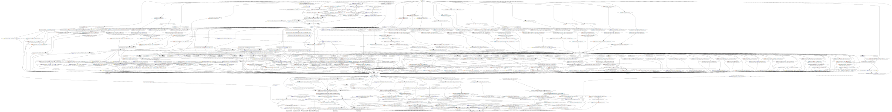
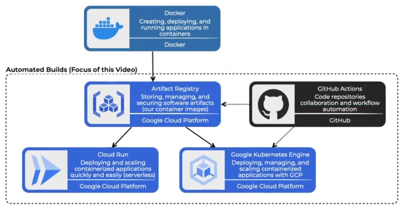

# List of Commands:
1. greeting
2. life
3. rock / paper / scissors
4. joke
5. weather in [CITY]
6. synonyms for [WORD]
  

# Diagrams

  

- This diagram demonstrates how the containerised application will be hosted on GCP's Artifact Registry and how GitHub Actions will be used to automate the deployment onto GCP's kubernetes cluster (GKE).
  

# Things that need to be done manually
- Create unique bucket to store terraform state remotely before running terraform apply
- Create service account for github actions (permissions: give the repo containing docker image 'Kubernetes Engine Developer' role, assign 'Artificant Registry Repository Administrator' role to the project)
  

# Instructions
- Enter desired values into terraform.tfvars file
- Terraform apply -auto-approve
- Once GKE is running, git push will start workflow
- Once deployed, run
> `gcloud container clusters get-credentials [CLUSTER_NAME]-[ENV_NAME] --region [REGION]`
- Followed by
> `watch -n 5 kubectl get services`
- Copy EXTERNAL-IP into browser
  

# Areas to improve
- Frontend and Backend repo names (react-client, flask-api)
- Separate docker images (2 or 3)
- Implement GitOps such as ArgoCD (delete old pods and spin up new ones on push to main)
- Add metrics to monitor cluster (Prometheus/Grafana)
  

# Useful Commands
- gcloud container clusters get-credentials gke-01-prod --region europe-west2
- npm start
- python app.py
- terraform graph | dot -Tsvg > graph.svg

# GitHub Actions Tests
- Test 1
- Test 2